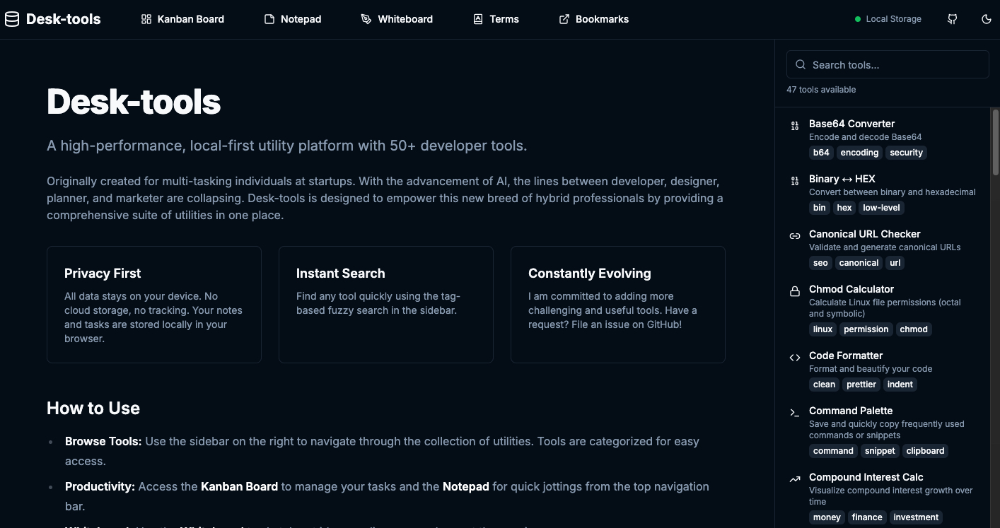

# Desk-tools 🛠️

A high-performance, local-first utility platform designed for multi-tasking individuals at startups.

**Live Service:** [https://zafrem.github.io/Desk-tools/](https://zafrem.github.io/Desk-tools/)



## 🌟 Overview

Desk-tools is a comprehensive suite of utilities built for "hybrid professionals"—developers, designers, planners, and marketers who need a fast, privacy-focused workspace.

Built with **Next.js 15**, it runs entirely in your browser. All data is stored locally using **IndexedDB**, ensuring your work stays private and never leaves your machine.

## 🔒 Privacy & Local-First

- **Zero Server-Side Storage**: Your notes, tasks, and settings are stored only in your browser.
- **Offline Capable**: Once loaded, most tools work without an internet connection.
- **Privacy by Design**: No tracking, no data collection, no account required.

## 🚀 Key Features

- **📊 Kanban & Gantt**: Manage projects with a flexible board and timeline view.
- **📝 Notepad**: Persistent note-taking with markdown support and tagging.
- **🎨 Whiteboard**: Sketch out ideas, diagrams, or wireframes.
- **🤖 AI Integration**: Connect to your local **Ollama** instance for private LLM-powered assistance.
- **📅 Daily & Weekly Planning**: Stay on track with task lists and recurring schedules.
- **🔖 Bookmarks**: Organize and manage your frequent links in one place.
- **📖 Terminology Management**: Maintain a consistent project vocabulary.
- 🔍 **Instant Search**: Find any specialized tool instantly with fuzzy search.

## 🤖 AI Features (Powered by Ollama)

If you have [Ollama](https://ollama.com/) running locally, Desk-tools can integrate with it to provide:
- **AI Chat**: Interact with your local models directly in the workspace.
- **Smart Tools**: Enhanced capabilities for code and text processing.
- **Private & Free**: No API keys needed, and your data stays on your local machine.

## 🛠️ Specialized Tools (53+)

| Category | Tools |
| --- | --- |
| **Developer** | JSON Explorer, Cron Expression, Regex Tester, Text Diff, Command Palette |
| **Security** | JWT Decoder, Hash Generator, Encryption Tool (AES), Password Generator |
| **Encoder** | Text Encoder, Base64 Converter, URL Encoder, HTML Entities |
| **Converter** | File Format Converter (JSON/XML/CSV), JSON ↔ CSV, Binary ↔ HEX, Timestamp Converter, Markup Converter (Wiki), Encoding Converter |
| **Designer** | Design Tools (Color/Palette/Placeholders), Icon Generator, Background Remover, Image Filters, Pixel Art Editor |
| **Generator** | JSON to Code, JSON Schema Gen, Short URL Gen, UUID Generator, QR Code Gen, Slug Generator, Robots.txt Generator, Sitemap Generator, Open Graph Generator, Schema Markup Gen |
| **Calculator** | Chmod Calculator, IP Subnet Calculator, Unit Converter, Date/D-Day Calc, Salary/Tax Calc, Loan Calculator, Compound Interest Calc, Keyword Density, Meta Tag Checker, Reading Time Calc, Word Counter, Canonical URL Checker |
| **Formatter** | Code Formatter, Text Case, SQL Formatter, Markdown Preview |
| **AI** | AI Chat (requires Ollama) |
| **Other** | PDF Tools, Pomodoro Timer |

## 💻 Tech Stack

- **Framework**: [Next.js 15](https://nextjs.org/) (App Router, Static Export)
- **Language**: [TypeScript](https://www.typescriptlang.org/)
- **UI**: [React 19](https://react.dev/), [Tailwind CSS](https://tailwindcss.com/), [Radix UI](https://www.radix-ui.com/), [Lucide React](https://lucide.dev/)
- **Database**: [Dexie.js](https://dexie.org/) (IndexedDB)
- **AI**: [Ollama](https://ollama.com/) (Local integration)
- **Utilities**: `date-fns`, `crypto-js`, `papaparse`, `fuse.js`

## 🛠️ Local Development

1. **Clone the repository**:
   ```bash
   git clone https://github.com/zafrem/Desk-tools.git
   cd Desk-tools
   ```

2. **Install dependencies**:
   ```bash
   npm install
   ```

3. **Run the development server**:
   ```bash
   npm run dev
   ```
   Open [http://localhost:3000](http://localhost:3000) in your browser.

4. **Build for production**:
   ```bash
   npm run build
   ```

## 🌐 Deployment

This project is configured for **GitHub Pages**. Any changes pushed to the `main` branch will automatically be deployed via GitHub Actions.

## 🤝 Feedback & Requests

I am committed to constantly evolving this platform. If you have a tool request or found a bug, please [open an issue on GitHub](https://github.com/zafrem/Desk-tools/issues).

---
Created by [zafrem](https://github.com/zafrem)